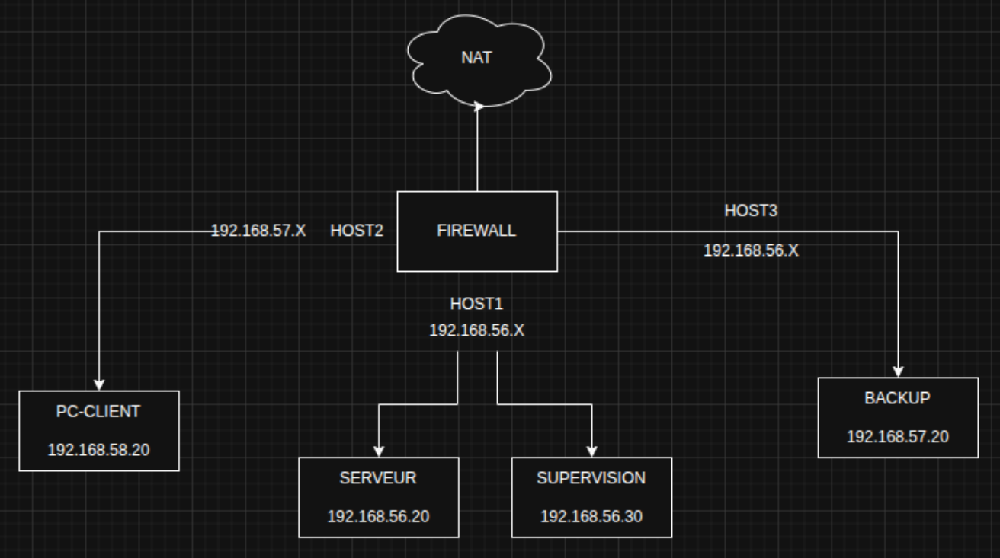

# Commmandes de configuration
‎ 

## 1️⃣ Infrastructure de base

### VM :
- Rocky-9.7-x86_64-minimal
- Mémoire vive : 2048
- Processeur : 2CPU
- 1.Optique 2.Disque dur
- adaptateur 1 : NAT
- adaptateur 2 : HostOnly


### Architecture réseau



Carte 1 : 192.168.56.1\
Carte 2 : 192.168.57.1\
Carte 3 : 192.168.58.1

FIREWALL:
- NAT
- Carte 1 -> 192.168.56.10 -> (serveur)
- Carte 2 -> 192.168.57.10 -> (backup)
- Carte 3 -> 197.168.58.10 -> (client)

SERVEUR :
- Carte 1 -> 192.168.56.20

BACKUP :
- Carte 2 -> 192.168.57.20

CLIENT :
- Carte 3 -> 192.168.58.20


### Configuration carte HostOnly

Création d'une carte Réseau sans DNS pour reliser en HostOnly.

```bash
sudo nano /etc/sysconfig/network-script/ifcfg-enp0s<CARTE>
```

```bash
DEVICE=<CARTE>
NAME=lan

ONBOOT=yes
BOOTPROTO=static

IPADDR=192.168.<IP-PC>
NETMASK=255.255.255.0
GATEWAY=198.168.<IP-FIREWALL>
DNS1=8.8.8.8
```

```bash
sudo nmcli con reload 
sudo nmcli con up lan
```

### Création d'un compte autre qu'**admin**

```bash
sudo adduser <NAME>
sudo passwd <NAME>
sudo usermod -aG wheel <NAME>
su - <NAME>
```

### Configuration SSH 

Cette configuration s'applique sur les VMs : FIREWALL, SERVEUR & BACKUP.

```bash
nano /etc/ssh/sshd_config
```

- Port 2222
- PermitRootLogin no
- PasswordAuthentication yes
- PermitEmptyPasswords no
- AllowUsers <VOTRE_USER>
- Protocol 2
- LoginGraceTime 60
- MaxAuthTries 3
- KbdInteractiveAuthentication no

Vérification erreur d'écriture :
```
sudo sshd -t
```

```
sudo firewall-cmd --permanent --add-port=2222/tcp
sudo firewall-cmd --reload
```

Régler le problème de **SELinux** qui bloque le port :

```
# Installer les outils nécessaires
sudo dnf install policycoreutils-python-utils -y

# Autoriser le port 2222 pour SSH dans SELinux
sudo semanage port -a -t ssh_port_t -p tcp 2222

# Vérifier que le port est bien ajouté
sudo semanage port -l | grep ssh

# Redémarrer SSH
sudo systemctl restart sshd

# Vérifier le statut
sudo systemctl status sshd
```

```bash
sudo systemctl reload sshd   
```


### Changement Hostname

```bash
sudo hostnamectl set-hostname <NAME>
```


### Configuration firewall

**Activer le forwarding IP (routage)**

```bash
# Activer temporairement
sudo sysctl -w net.ipv4.ip_forward=1

# Rendre permanent
sudo sed -i 's/#net.ipv4.ip_forward=1/net.ipv4.ip_forward=1/' /etc/sysctl.conf
sudo sysctl -p
```

**Configurer les zones firewall**

```bash
# Assigner les interfaces aux zones
sudo firewall-cmd --permanent --zone=public --add-interface=enp0s3
sudo firewall-cmd --permanent --zone=internal --add-interface=enp0s8
sudo firewall-cmd --permanent --zone=internal --add-interface=enp0s9
sudo firewall-cmd --permanent --zone=internal --add-interface=enp0s10
sudo firewall-cmd --reload
```

**Activer le NAT (masquerading)**

```bash
# Activer le masquerading sur les zones
sudo firewall-cmd --permanent --zone=public --add-masquerade
sudo firewall-cmd --permanent --zone=internal --add-masquerade
sudo firewall-cmd --reload
```

**Autoriser le forwarding depuis la zone internal**

```bash
# Changer le target de la zone internal pour autoriser le forwarding
sudo firewall-cmd --permanent --zone=internal --set-target=ACCEPT
sudo firewall-cmd --reload
```

**Vérification**

```bash
# Vérifier la configuration
sudo firewall-cmd --zone=public --list-all
sudo firewall-cmd --zone=internal --list-all
cat /proc/sys/net/ipv4/ip_forward
```


‎ 
## 2️⃣ Sauvegarde et restauration


Script de sauvegarde à automatisé avec cron.

```bash
sudo crontab -e
0 3 * * * /usr/local/bin/backup_rsync.sh 
```

Nom du fichier de sauvegarde : `backup_rsync.sh`.

La sauvegarde sert a enregistrer tous les fichiers qu'il y a sur la VM.\
Une fois la sauvevegarde faite, nous revevons un mail du status de la sauvegarde ainsi que l'emplacement de la sauvegarde.


‎ 
## 3️⃣ Services réseau

### Service web https

```bash
sudo dnf update -y
```

```bash
sudo dnf install nginx -y
```

```bash
sudo systemctl enable --now nginx
```

- Vérification si c'est enable
```bash
sudo systemctl status nginx
```

```
sudo firewall-cmd --permanent --add-service=http
sudo firewall-cmd --reload
```

- Site accessbile via l'ip de la machine sur internet normalement
```bash
sudo mkdir /etc/nginx/certificate
```

``` bash
cd /etc/nginx/certificate
```

```bash
sudo openssl req -new -newkey rsa:4096 -x509 -sha256 -days 365 -nodes -out nginx-certificate.crt -keyout nginx.key
```

```bash
sudo nano /etc/nginx/nginx.conf
```

Rajouter la ligne suivante : `return 301 https://$host$request_uri;`\
De sorte a avoir un bloc comme celui ci :

```bash
server {
	listen       80;
    listen       [::]:80;
    server_name  _;

    return 301 https://$host$request_uri;
}
```

- Les deux commandes suivantes sont l'ajout de la redirection http vers https   
```bash
sudo nano /etc/nginx/conf.d/ssl.conf
```

```bash
server {
    listen 443 ssl;
    listen [::]:443 ssl;

    server_name _;

    ssl_certificate     /etc/nginx/certificate/nginx-certificate.crt;
    ssl_certificate_key /etc/nginx/certificate/nginx.key;

    ssl_protocols TLSv1.2 TLSv1.3;
    ssl_ciphers HIGH:!aNULL:!MD5;

    root /usr/share/nginx/html;
    index index.html index.htm;
}
```

```bash
sudo nginx -t
```

```bash
sudo systemctl reload nginx
```

```bash
sudo firewall-cmd --permanent --add-service=https
sudo firewall-cmd --reload
```


### Service mail

```bash
sudo hostnamectl set-hostname mail.example.local
```

```bash
sudo nano /etc/hosts
127.0.0.1   mail.example.local mail
```

```bash
sudo dnf install postfix -y
```

```bash
sudo systemctl enable --now postfix
```

```bash
sudo nano /etc/postfix/main.cf
```

- A complete dans la commande avt
```bash
myhostname = mail.example.local
mydomain = example.local
myorigin = $mydomain
inet_interfaces = all
inet_protocols = ipv4
mydestination = $myhostname, localhost.$mydomain, localhost, $mydomain
mynetworks = 127.0.0.0/8
home_mailbox = Maildir/

```

```bash
sudo systemctl restart postfix
```

```bash
sudo dnf install dovecot -y
sudo systemctl enable --now dovecot
```

Rajouter la ligne suivante `protocols = imap pop3 lmtp` dans :
```bash
sudo nano /etc/dovecot/dovecot.conf
```

Rajouter la ligne suivante `mail_location = maildir:~/Maildir` dans :
```bash
sudo nano /etc/dovecot/conf.d/10-mail.conf
```

```bash
sudo firewall-cmd --permanent --add-service=smtp
sudo firewall-cmd --permanent --add-service=imap
sudo firewall-cmd --permanent --add-service=imaps
sudo firewall-cmd --reload
```

```bash
sudo adduser test
sudo passwd test
```

```bash
sudo mkdir -p /home/test/Maildir
sudo chown -R test:test /home/test/Maildir
```

```bash
sudo dnf install s-nail -y
```

```bash
echo "Ceci est un test" | mail -s "Test SMTP" test@localhost
```

```bash
sudo ls /home/test/Maildir/new
```

- Sur votre PC

```bash
telnet 192.168.56.20 25
```

```bash
EHLO pc-hote
MAIL FROM:<test@example.local>
RCPT TO:<test@example.local>
DATA
Subject: Test depuis PC
Ceci est un test
.
QUIT
```

- Sur la VM
```bash
sudo ls /home/test/Maildir/new
```

‎ 
## 4️⃣ Conteneurisation

‎ 
## 5️⃣ Automatisation

‎ 
## 6️⃣ Surveillance